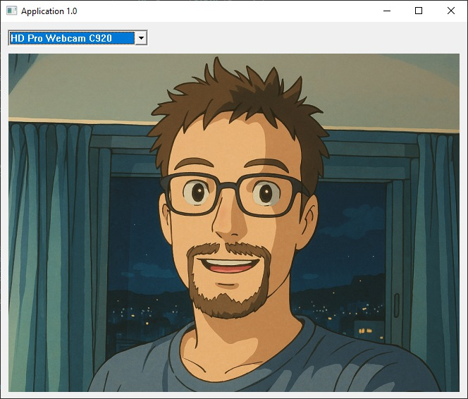

# Camera Capture with Media Foundation

## Introduction

In this article we will expand on the [windows message loop](windows-message-loop.md) example to include camera capture using the Media Foundation. This is a high-level API for multimedia processing on Windows, and it provides a framework for capturing, processing, and rendering audio and video. The Media Foundation is a COM-based framework and provides a higher-level abstraction for working with multimedia conten, this means that it uses interfaces and classes to represent multimedia components. Note that code is purposedly condensed to focus on the relevant parts.

<p align="center">
  
</p>

## The Component Object Model

The COM (Component Object Model) is a binary-interface standard for software components that allows for inter-process communication and dynamic object creation. In particular it is a method of loading already compiled binaries and accessing/querying their interfaces.

## Preparations

### Dependencies and Libraries

We start by preparing our application with a set of utilities, in particular we need a smart pointer class to manage the lifetime of COM objects. The `CComPtr` class is a smart pointer that automatically releases the COM object when it goes out of scope, we include that from the `atlbase.h` header file. We also need to include the `mfapi.h`, `mfidl.h` and `mfreadwrite.h` header files for the Media Foundation API. In this example, we will not dynamically load our library thus we will link against a set of static libraries that contain functions that we need. The libraries in question are `mf.lib`, `mfplat.lib`, `mfreadwrite.lib` and `mfuuid.lib`. It is not *required* to statically link them and this will cause our program to fail if the libraries are not present on the system. Using a more dynamic approach would allow fallback to using DirectShow or similar if required but that is out of scope for this article. In order to link to our libraries we will use the `#pragma comment(lib, "library")` directive.

```c++
#define WIN32_LEAN_AND_MEAN
#include <windows.h>
#include <tchar.h>
#include <commctrl.h>

#include <atlbase.h>
#include <mfapi.h>
#include <mfidl.h>
#include <mfreadwrite.h>

#pragma comment(lib, "mf.lib")
#pragma comment(lib, "mfplat.lib")
#pragma comment(lib, "mfreadwrite.lib")
#pragma comment(lib, "mfuuid.lib")
```

### A Minimal Smart Pointer

For management dynamic memory allocation we can use `std::unique_ptr`, `std::shared_ptr` or `boost::scoped_ptr` but let's roll our own method quickly for simplicity and verbosity. We need a container class that basically deallocates our object when it goes out of scope. Since I will be using `new` to allocate objects in this example, this smart pointer will be calling `delete` on the pointer when it goes out of scope. The handling of pointers and memory is a complete topic on its own so let's not delve into this further and save it as a future topic.

```c++
template <typename T>
class Scope {
private:
  T* ptr_;

public:
  explicit Scope(T* ptr = nullptr) noexcept
    : ptr_{ptr} {}

  ~Scope() {
    delete ptr_;
  }

  operator T*() const noexcept {
    return ptr_;
  }

  T* operator=(T* ptr) noexcept {
    delete ptr_;
    ptr_ = ptr;
    return ptr_;
  }

  T* operator->() const noexcept {
    return ptr_; 
  }

  T& operator*() const noexcept {
    return *ptr_;
  }
};
```

### The Windows Multi-String

A common pattern used in windows are null-terminated string in favor of string views, also at times these are concatenated into something called a multi-string. Examples are `GetOpenFileName`/`GetSaveFileName` for multiple selection of files and more. A multi-string is a null-terminated string with multiple null-terminated strings concatenated together, thus the last string is followed by an additional null character.

```plaintext
   =====================================================================================================
  | 'S' | 't' | 'r' | 'i' | 'n' | 'g' | '1' |  0  | 'S' | 't' | 'r' | 'i' | 'n' | 'g' | '2' |  0  |  0  |
   =====================================================================================================
```

Let's create a basic class to handle such strings and easily iterate over them, it may prove useful for other situations. Let us use a template argument to set the number of characters we would like to reserve, not to be confused with size as this can be either wide characters or an ANSI characters depending on the defintion of `TCHAR` upon compilation.

```c++
template <UINT CharacterCount>
class MultiString {
private:
  TCHAR buffer_[CharacterCount];

  Names() noexcept
    : buffer_{} {}

public:
  static MultiString<CharacterCount>* create() noexcept {
    return new Names<CharacterCount>();
  }

  const TCHAR* append(const TCHAR* str) noexcept {
    TCHAR* buffer = buffer_;
    while (*buffer != 0) {
      buffer += std::_tcslen(buffer) + 1;
    };
    if (buffer + std::_tcslen(str) + 1 >= buffer_ + CharacterCount) {
      return nullptr;
    }
    std::_tcscpy(buffer, str);
    return buffer;
  }
};
```

Let us also add a simple iterator class that we nest inside the `MultiString` class. This iterator will allow us to iterate over the strings in the multi-string. Along with this two functions `begin` and `end` will need to be added to the above class to provide values for the iterators.

```c++
  class Iter {
  private:
    const TCHAR* buffer_;
    
    static const TCHAR* findNext(const TCHAR* buffer) noexcept {
      buffer += std::_tcslen(buffer) + 1;
      return *buffer != 0 ? buffer : nullptr;
    }

  public:
    Iter(const TCHAR* buffer) noexcept
      : buffer_{buffer} {}

    const TCHAR* operator*() const noexcept {
      return buffer_;
    }

    bool operator!=(const Iter& rhs) const noexcept {
      return buffer_ != rhs.buffer_;
    }

    Iter& operator++() noexcept {
      buffer_ = buffer_ ? findNext(buffer_) : nullptr;
      return *this;
    }
  };
```

## Adding a List of Cameras

Controls such as buttons, edit boxes, combo boxes and other UI elements are also windows and are thus created using the same procedure as our main window, the main difference being that we provide a different class name to the `CreateWindow` function. In this case we will use `WC_COMBOBOX` for our camera list which is available in `commctrl.h`. Let's create it when we receive the `WM_CREATE` message in our main window procedure. Note that there is no need to keep track of the window handles for the purpose of resource deallocation as they will be automatically destroyed when the main window is destroyed. Flags such as `CBS_DROPDOWNLIST` is a specific style for the combo box where as `WS_VISIBLE` and `WS_CHILD` are more generic window flags.

```c++
  case WM_CREATE: {
    HWND hComboBox = CreateWindow(WC_COMBOBOX, _T(""), WS_VISIBLE | WS_CHILD | CBS_DROPDOWNLIST, 10, 11, 200, 200, hWnd, nullptr, nullptr, nullptr);
    // Pseudo code to add camera names to our selection list
    for (MediaFoundation::Camera::Names<1024>::Iter iter = cameraNames->begin(); iter != cameraNames->end(); ++iter) {
      SendMessage(hComboBox, CB_ADDSTRING, 0, reinterpret_cast<LPARAM>(*iter));
    }
    break;
  }
```

## Creating a Camera and Drawing the Frames

When the user selects a camera from the list we will start the camera capture. The selection event is sent as a `WM_COMMAND` message to our window procedure. Since it is the only control in our window we only need to verify the event type, get the selected item index using `CB_GETCURSEL` and start the camera capture. We will also need to invalidate the window to trigger a repaint. 

```c++
  case WM_COMMAND: {
    if (HIWORD(wParam) == CBN_SELCHANGE) {
      HWND hComboBox = reinterpret_cast<HWND>(lParam);
      int index = static_cast<int>(SendMessage(hComboBox, CB_GETCURSEL, 0, 0));
      if (index != CB_ERR) {
        // Reset the camera object if it exists (before we create a new one)
        camera = nullptr;
        // Pseudo code create a camera device
        camera = mf->createCamera(index);
        InvalidateRect(hWnd, nullptr, TRUE);
      }
    }
    break;
  }
```

The `WM_PAINT` message is sent when the window needs to be repainted, we will use this to grab a frame from the camera and draw it on the window. Note that we are using the `BitBlt` function to copy the bitmap from our buffer into our main window, this requires the bitmap to be in a compatible format with the device context of our window (in this case 32-bit BGRA), we will do that conversion in the grab function. All drawing operations need to be performed within the scope of `BeginPaint` and `EndPaint` to ensure that the window is properly updated. We do not use any RAII wrapper in this example as our code doesn't throw any exceptions and is marked `noexcept` anyhow.

```c++
  case WM_PAINT: {
    if (camera) {
      // Pseudo code to grab a frame from the camera
      if (HBITMAP hBitmap = camera->grab()) {
        PAINTSTRUCT ps;
        if (HDC hdc = BeginPaint(hWnd, &ps)) {
          if (HDC hMemDC = CreateCompatibleDC(hdc)) {
            SelectObject(hMemDC, hBitmap);
            // Center the bitmap in the window
            int x = (ps.rcPaint.right - ps.rcPaint.left - camera->getWidth()) / 2;
            int y = (ps.rcPaint.bottom - ps.rcPaint.top - camera->getHeight()) / 2;
            BitBlt(hdc, x, y, camera->getWidth(), camera->getHeight(), hMemDC, 0, 0, SRCCOPY);
            DeleteDC(hMemDC);
          }
          EndPaint(hWnd, &ps);
        }
        DeleteObject(hBitmap);
      }
    }
    break;
  }
```

## Updating Our Window Loop

Now is the time to throw out our calls to `GetMessage` in favor of `PeekMessage` to crank up the framerate. This will allow our application to trigger a redraw even when there are no messages to process, in our case we will use `InvalidateRect` which may not be exactly what rendering applications normally use but it will suffice for our use case. Naturally this will increase the CPU usage of our application, but for a any type of media processing application this is a common pattern.

```c++
MSG msg{};
do {
  if (PeekMessage(&msg, nullptr, 0, 0, PM_REMOVE)) {
    if (msg.message == WM_QUIT) {
      break;
    }
    TranslateMessage(&msg);
    DispatchMessage(&msg);
  } else {
    InvalidateRect(hWnd, nullptr, FALSE);
  }
} while (true);
```

## Implementing the Backend Camera Capture

### Initializing the Media Foundation

Before we can use the Media Foundation, we need to initialize it using the `MFStartup` function. This function initializes the Media Foundation platform and must be called before any other Media Foundation functions are called. We will also need to shut down the Media Foundation when we are done using it, this is done using the `MFShutdown` function. Let's use our pseudo wrapper pattern by creating a scoped class that takes care of deinitializing the Media Foundation when it goes out of scope. Initialization will occur when we create an instance of the class, for that reason we decide to keep our constructor private.

```c++
class MediaFoundation {
private:
  MediaFoundation() noexcept {}

public:
  static MediaFoundation* create() {
    return SUCCEEDED(MFStartup(MF_VERSION, MFSTARTUP_LITE)) ? new MediaFoundation() : nullptr;
  }

  ~MediaFoundation() {
    MFShutdown();
  }
};
```

### The Camera Class

Since the camera system is part of the MediaFoundation we can wrap it within this class to ensure that it has been initialized properly. The code for initialization is pretty straightforward but there are many steps involving querying interface pointers to the right objects and query the system for devices (`MF_DEVSOURCE_ATTRIBUTE_SOURCE_TYPE_VIDCAP_GUID`). When we find a device that we like we can choose to activate and get an instance of the object using `ActivateObject`. When using function calls such as `ActivateObject`, a successful return value is essentially a contract that the provided pointer object (in this case `reinterpret_cast<void**>(&pMediaSource)`) has been initialized and is valid. Note that there are cases when this is not true so please make sure to consult the documentation on whether you need to verify the pointer or not. An example of a function that does *not* always fill the pointer value is `ReadSample` that we will use later so please be cautious or you may stumble across undefined behavior.

```c++
  Camera* createCamera(int index) {
    CComPtr<IMFAttributes> pAttributes;
    CComPtrArray<IMFActivate> ppDevices;
    if (FAILED(MFCreateAttributes(&pAttributes, 1))) return nullptr;
    if (FAILED(pAttributes->SetGUID(MF_DEVSOURCE_ATTRIBUTE_SOURCE_TYPE, MF_DEVSOURCE_ATTRIBUTE_SOURCE_TYPE_VIDCAP_GUID))) return nullptr;
    if (FAILED(MFEnumDeviceSources(pAttributes, &ppDevices.array, &ppDevices.count))) return nullptr;

    CComPtr<IMFMediaSource> pMediaSource;
    if (FAILED(ppDevices.array[index]->ActivateObject(IID_IMFMediaSource, reinterpret_cast<void**>(&pMediaSource)))) return nullptr;

    CComPtr<IMFSourceReader> pReader;
    if (FAILED(MFCreateSourceReaderFromMediaSource(pMediaSource, pAttributes, &pReader))) return nullptr;
    if (FAILED(pReader->SetStreamSelection(MF_SOURCE_READER_FIRST_VIDEO_STREAM, TRUE))) return nullptr;

    CComPtr<IMFMediaType> pNativeType;
    if (FAILED(pReader->GetNativeMediaType(MF_SOURCE_READER_FIRST_VIDEO_STREAM, 0, &pNativeType))) return nullptr;

    UINT32 width = 0, height = 0;
    if (FAILED(MFGetAttributeSize(pNativeType, MF_MT_FRAME_SIZE, &width, &height))) return nullptr;

    return new Camera(pReader.Detach(), width, height);
  }
```

Using just an index to select a camera is not particularly user friendly so let's make sure to query the device names as well. This is done using the `MF_DEVSOURCE_ATTRIBUTE_FRIENDLY_NAME` attribute. We will use a `MultiString` object to store the names of the devices in a multi-string format as the string returned from our object is owned by the object and needs to be released properly or tracked somehow. In order to avoid memory leaks we just copy the buffer and release the original. Note that strings retrieved using this interface is using wide character literals so if we would like to support UTF-8 or ANSI we would need to convert the string to the desired format. For this example we will be locked in to using UTF-16/UCS-2.

```c++
  template <UINT CharacterCount>
  bool initNames(Camera::Names<CharacterCount>& names, const TCHAR* defaultName) noexcept {
    CComPtr<IMFAttributes> pAttributes;
    CComPtrArray<IMFActivate> ppDevices;
    if (FAILED(MFCreateAttributes(&pAttributes, 1))) return false;
    if (FAILED(pAttributes->SetGUID(MF_DEVSOURCE_ATTRIBUTE_SOURCE_TYPE, MF_DEVSOURCE_ATTRIBUTE_SOURCE_TYPE_VIDCAP_GUID))) return false;
    if (FAILED(MFEnumDeviceSources(pAttributes, &ppDevices.array, &ppDevices.count))) return false;

    for (UINT32 i = 0; i < ppDevices.count; ++i) {
      WCHAR* pName = nullptr;
      UINT32 cchName = 0;
      if (SUCCEEDED(ppDevices.array[i]->GetAllocatedString(MF_DEVSOURCE_ATTRIBUTE_FRIENDLY_NAME, &pName, &cchName))) {
        names.append(pName);
        CoTaskMemFree(pName);
        continue;
      }
      names.append(defaultName);
    }
    return true;
  }
```

Let's look briefly at the outline of the camera interface below. Essentially just a container of the COM interface pointer along with the width and height of the camera. The `grab` function will be responsible for grabbing a frame from the camera and converting it to a bitmap that can be used by the `BitBlt` function. We choose to return the result as a raw `HBITMAP` for simplicity which I wouldn't neccessarily recommend in a production application but since this is just an example and we have already made sure that the calling function deletes the handle using `DeleteObject` we can get away with it.


```c++
  class Camera {
  private:
    friend class MediaFoundation;

    CComPtr<IMFSourceReader> reader_;
    UINT width_;
    UINT height_;

    Camera(IMFSourceReader* reader, UINT width, UINT height) noexcept
      : reader_(reader)
      , width_(width)
      , height_(height) {}

  public:
    UINT getWidth() const noexcept {
      return width_;
    }

    UINT getHeight() const noexcept {
      return height_;
    }

    HBITMAP grab() noexcept;
  };
```

### Implementing the Grab Function

The `grab` function will be responsible for grabbing a frame from and converting it to a bitmap that we create using BGRA pixels and the `CreateDIBitmap` function. The function will also need to convert the YUV422 format to BGRA format before we can use it with the `BitBlt` function. The `grab` function will be called from the `WM_PAINT` message handler in our main window procedure. We will also need to create a bitmap info header that describes the bitmap format and size, this is done using the `BITMAPINFO` structure.

```c++
  BITMAPINFO bmi{};
  bmi.bmiHeader.biSize = sizeof(BITMAPINFOHEADER);
  bmi.bmiHeader.biWidth = width_;
  bmi.bmiHeader.biHeight = -static_cast<decltype(bmi.bmiHeader.biHeight)>(height_);
  bmi.bmiHeader.biPlanes = 1;
  bmi.bmiHeader.biBitCount = 32;
  bmi.bmiHeader.biCompression = BI_RGB;
```

And the rest of the boilerplate code is as follows:

```c++
  HBITMAP Camera::grab() noexcept {
    CComPtr<IMFSample> pSample;
    DWORD dwStreamIndex;
    DWORD dwFlags;
    LONGLONG llTimeStamp;

    if (FAILED(reader_->ReadSample(MF_SOURCE_READER_FIRST_VIDEO_STREAM, 0, &dwStreamIndex, &dwFlags, &llTimeStamp, &pSample)) || !pSample) return nullptr;

    CComPtr<IMFMediaBuffer> pBuffer;
    pSample->ConvertToContiguousBuffer(&pBuffer);
    struct LockScope {
      ~LockScope() {
        pBuffer->Unlock();
      }
      IMFMediaBuffer* pBuffer;
    } lock{pBuffer};

    BYTE* pData = nullptr;
    DWORD maxLen = 0;
    DWORD currLen = 0;
    pBuffer->Lock(&pData, &maxLen, &currLen);

    // ...

    struct Image {
      ~Image() {
        free(data);
      }
      UINT width;
      UINT height;
      BYTE* data;
    } image{width_, height_, static_cast<BYTE*>(malloc(width_ * height_ * 4))};
    if (!image.data) return nullptr;

    for (UINT i = 0; i < image.width * image.height; ++i) {
      float y = pData[(i * 2)];
      float u = pData[(i / 2) * 4 + 1] - 128.0f;
      float v = pData[(i / 2) * 4 + 3] - 128.0f;
      y = (y <= 16.0f) ? 0.0f : (y <= 239.0f) ? (y - 16.0f) * 1.164f : (239.0f - 16.0f) * 1.164f;
      image.data[(i * 4) + 0] = static_cast<BYTE>(max(0.0f, min(255.0f, y + 1.976f * u)));              // B
      image.data[(i * 4) + 1] = static_cast<BYTE>(max(0.0f, min(255.0f, y - 0.383f * u - 0.813f * v))); // G
      image.data[(i * 4) + 2] = static_cast<BYTE>(max(0.0f, min(255.0f, y + 1.596f * v)));              // R
      image.data[(i * 4) + 3] = 255; // Alpha channel set to 255 (opaque)
    }

    return CreateDIBitmap(hdc, &bmi.bmiHeader, CBM_INIT, image.data, &bmi, DIB_RGB_COLORS);
  }
```

The camera data stream is usually encoding in something like YUV422 or YUV420 so we will need to convert the data to 32-bit BGRA before we can use it with the `BitBlt` function. YUV422 is essentially one channel of luminance (Y) and two channels of chrominance (U and V) but the chrominance channels are subsampled and interleaved with the luminance values, YUV422 is subsampled horizontally where as YUV420 is subsampled both horizontally and vertically.

```plaintext
   _______________________________________________________________________________________
  |  Y_0,0  | U_0,0/1 |  Y_0,1  | V_0,0/1 |  Y_0,2  | U_0,2/3 |  Y_0,3  | V_0,2/3 |  ...  
  |---------+---------+---------+---------+---------+---------+---------+---------+-------
  |  Y_1,0  | U_1,0/1 |  Y_1,1  | V_1,0/1 |  Y_1,2  | U_1,2/3 |  Y_1,3  | V_1,2/3 |  ...  
  |---------+---------+---------+---------+---------+---------+---------+---------+-------
  |   ...   |   ...   |   ...   |   ...   |   ...   |   ...   |   ...   |   ...   |  ...  
```

We rearrange with conversion factors to the 32-bit BGRA layout that we need.

```plaintext
   _______________________________________________________________________________________
  |  B_0,0  |  G_0,0  |  R_0,0  |  A_0,0  |  B_0,1  |  G_0,1  |  R_0,1  |  A_0,1  |  ...  
  |---------+---------+---------+---------+---------+---------+---------+---------+-------
  |  B_1,0  |  G_1,0  |  R_1,0  |  A_1,0  |  B_1,1  |  G_1,1  |  R_1,1  |  A_1,1  |  ...  
  |---------+---------+---------+---------+---------+---------+---------+---------+-------
  |   ...   |   ...   |   ...   |   ...   |   ...   |   ...   |   ...   |   ...   |  ...  
```

## Summary

So we have shown a simple example of how to use the Windows Media Foundation to capture video from a camera and display it in a window. We have also shown how to use COM objects and smart pointers to manage the lifetime of the objects. In addition we created a window control and displayed a list of available cameras. One of the highlights of this interface is that the name of the cameras are displayed to the user, this is unfortunately missing in the Windows Camera application. One of the benefits of the traditional UI applications was a more coherent design and usage of mnemonics, tabstops, keyboard shortcuts etc. which are often overlooked in more modern UI libraries. In any case using someting *WTL* or *ImGUI* is a future step in order to avoid boilerplate code and make the application more modern. 

