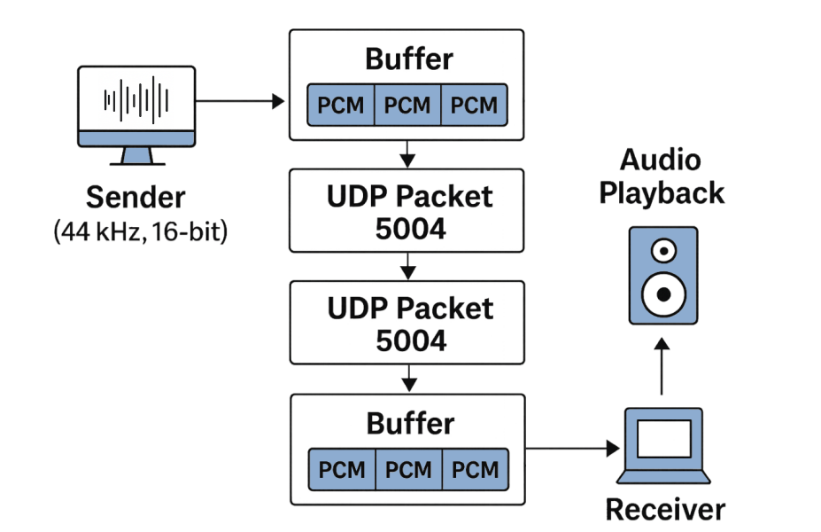
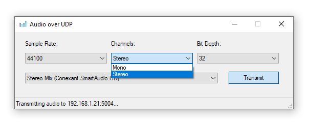

# Virtual Audio Cable over Ethernet

## Introduction

Lately I had the need to forward audio data from a laptop to my home theater system which was connected to a different computer on the network thus we will be looking at how to create a virtual audio cable using Winsock2 and the Core Audio API (Multimedia Device API and Windows Audio Session API). The goal is to to capture and render audio data and forward it over a network with relatively low latency. Assuming you have several computers on your home network but only one of them is connected to your home theater system and you would like to play audio from your other computers on your home theater system. This article aims to show some basics on streaming audio data without the need for a full-fledged media server or RTP (Real-time Transport Protocol) and of course also without the need for a physical audio cable instead utilizing the already existing network infrastructure. The strategy is to send raw PCM (Pulse Code Modulated) audio samples.

<p align="center">
  
</p>

### The Core Audio API

The Core Audio API is a low-level API for audio processing in Windows. It provides methods to access and control audio devices, streams, and sessions. We will be using two parts of the API, The Multimedia Device API (MMDevice API) and the Windows Audio Session API (WASAPI). The Core Audio API is designed to be used by developers who need low-level access to audio hardware and software. It provides a set of COM interfaces that allow developers to interact with audio devices and streams directly, without the need for higher-level abstractions or libraries. The MMDevice API provides methods to enumerate audio device endpoints available in the system, while the WASAPI provides methods to access and control audio streams, this is the larger portion of the API.

### The Windows Sockets API

The Windows Sockets API (Winsock) allows a user to create outgoing and incoming sockets for network data without worrying too much about protocol specifics. We will be using UDP which is just two endpoints with no flow control or error correction as opposed to TCP/IP which also can handle congestion control and retransmission of lost packets but at the cost of potentially higher latency. The API is very similar to the POSIX sockets API but there are some minor differences in the function names and structures.

## Preparations

### WinSock

We will be using the Winsock2 API for network communication, we create our `winsock.inl` file so that we can implement the basics for our use-case. The linker library is `Ws2_32.lib` and its supporting header files are `winsock2.h` and `ws2tcpip.h`. It is also required that Winsock is initialized before any other Winsock functions are called. This is done using the `WSAStartup` function. The `WSACleanup` function is used to clean up the Winsock library when it is no longer needed. We allow for the object to be created on the heap and when a scoped pointer (see [A Minimal Smart Pointer](media-foundation.md)) holding it goes out of scope we will unload the library.

```c++
#include <winsock2.h>
#include <Ws2tcpip.h>

#pragma comment(lib, "Ws2_32.lib")

namespace {

class WinSock {
private:
  WinSock() noexcept {}

public:
  static WinSock* create() {
    WSADATA wsa;
    return SUCCEEDED(WSAStartup(MAKEWORD(2, 2), &wsa)) ? new WinSock() : nullptr;
  }

  ~WinSock() noexcept {
    WSACleanup();
  }
};

} // namespace
```

In addition to the above we implement a uni-directional UDP socket class that can send and receive data. The `sendto` and `recv` functions are used to send and receive data over the socket. The socket is closed using the `closesocket` function and in a similar manner we will allow for a scoped pointer to hold the socket object and delete it when it goes out of scope. We will revisit how to create instances of this class later in the article.

```c++
  class Socket {
  private:
    friend class WinSock;

    SOCKET sock_;
    sockaddr_in addr_;

    Socket(SOCKET sock, sockaddr_in addr) noexcept : sock_(sock), addr_(addr) {}

  public:
    int send(const char* buffer, int len, int flags = 0) noexcept {
      return sendto(sock_, buffer, len, flags, reinterpret_cast<sockaddr*>(&addr_), sizeof(addr_));
    }

    int receive(char* buffer, int len, int flags = 0) noexcept {
      return recv(sock_, buffer, len, flags);
    }

    ~Socket() noexcept {
      closesocket(sock_);
    }
  };
```

### Core Audio

Our audio class (`audio.inl`) will be used as a namespace object and make sure that COM is initialized and uninitialized properly. The `CoInitializeEx` function is used to initialize the COM library for use by the calling thread, and `CoUninitialize` is used to uninitialize COM. 

```c++
#include <atlbase.h>
#include <audioclient.h>
#include <mmdeviceapi.h>
#include <Functiondiscoverykeys_devpkey.h>

#pragma comment(lib, "ole32.lib")

class Audio {
private:
  Audio() noexcept {}

public:
  ~Audio() noexcept {
    CoUninitialize();
  }

  static Audio* create() {
    return SUCCEEDED(CoInitializeEx(nullptr, COINIT_MULTITHREADED)) ? new Audio() : nullptr;
  }
};
```

We place our rendering and capture classes here as well and make sure that they are friend classes of the `Audio` class so that it can create instances of the two, notice I am using a `std::vector<std::tstring>` reference to populate the names of the devices and to create a device, the index of the device in the list needs to be provided to `createRenderDevice`.

```c++
  class Render {
  private:
    friend class Audio;

    HANDLE hEvent_;
    WAVEFORMATEX waveFormat_;
    IMMDevice* pDevice_;
    IAudioClient* pClient_;
    IAudioRenderClient* pRender_;

    Render(IMMDevice* pDevice, IAudioClient* pClient, IAudioRenderClient* pRender, HANDLE hEvent, const WAVEFORMATEX& waveFormat) noexcept
      : hEvent_(hEvent), waveFormat_(waveFormat), pDevice_(pDevice), pClient_(pClient), pRender_(pRender) {}

  public:
    ~Render() noexcept {
      pRender_->Release();
      pClient_->Release();  
      pDevice_->Release();
      CloseHandle(hEvent_);
    }
  };

  bool initRenderNames(std::vector<std::tstring>& names, const TCHAR* defaultName = _T("Unrecognized Device")) noexcept;

  Render* createRenderDevice(int deviceIndex, int channels, int sampleRate, int bitDepth);

```

The core interfaces we expose are `IAudioClient` and `IAudioRenderClient`. The `IAudioClient` interface is used to initialize the audio client and set the format of the audio stream. The `IAudioRenderClient` interface is used to write audio data to the render endpoint. The `WAVEFORMATEX` structure is used to describe the format of the audio stream such as sample rate, bit depth, and number of channels. We do the identical class for capturing audio but substituting our `IAudioRenderClient` with `IAudioCaptureClient`.

```c++
  class Capture {
  private:
    friend class Audio;

    HANDLE hEvent_;
    WAVEFORMATEX waveFormat_;
    IMMDevice* pDevice_;
    IAudioClient* pClient_;
    IAudioCaptureClient* pCapture_;

    Capture(IMMDevice* pDevice, IAudioClient* pClient, IAudioCaptureClient* pCapture, HANDLE hEvent, const WAVEFORMATEX& waveFormat) noexcept 
      : hEvent_(hEvent), waveFormat_(waveFormat), pDevice_(pDevice), pClient_(pClient), pCapture_(pCapture) {}

  public:
    ~Capture() noexcept {
      pCapture_->Release();
      pClient_->Release();  
      pDevice_->Release();
      CloseHandle(hEvent_);
    }
  };

  bool initCaptureNames(std::vector<std::tstring>& names, const TCHAR* defaultName = _T("Unrecognized Device")) noexcept;

  Capture* createCaptureDevice(int deviceIndex, int channels, int sampleRate, int bitDepth);

```

## Implementation

We can start with the main implementation, most of the code below is using `stdout` and `stdin` for output and input but with some extra effort a nice user interface can be created as described in previous/future articles, see screenshot below.

<p align="center">
  
</p>

Also, this manifest below is required to ensure that the application uses the modern Windows Common Controls, such as the visual styles for buttons and other controls. This is necessary for the application to look modern and consistent with other Windows applications.

```c++
#pragma comment(                                     \
  linker,                                            \
  "\"/manifestdependency:type='win32'                \
  name='Microsoft.Windows.Common-Controls'           \
  version='6.0.0.0'                                  \
  processorArchitecture='*'                          \
  publicKeyToken='6595b64144ccf1df' language='*'\"")
```

### Setting up WinSock

#### Transmitting Socket

We begin by initializing our WinSock class using our scoped pointer. We need to implement the `createSenderUDP` function as well to properly instantiate our listener UDP socket.

```c++
Scope<WinSock> ws(WinSock::create());
Scope<WinSock::Socket> socket(ws->createSenderUDP(ip, 5004));
```

The socket can be created by providing the target IP address as well as the port number (a value between 1024 and 65535, numbers below 1024 are generally reserved for system use). Things to point out below is that we use `SOCK_DGRAM` and `IPPROTO_UDP` to specifiy UDP without any handshake or explicit connection, if there is no receiver listening, packets will be dropped. We also use `InetPton` to convert the target IP address from a string to a binary format. For IPv6 support we may choose to use `AF_INET6` instead of `AF_INET` in addition to a few minor updates on how we are handling our IP parameters, essentially probing whether the IP address is IPv6 and allowing for a fallback to IPv4 if it is not.

```c++
  Socket* createSenderUDP(const TCHAR* ip, int port) {
    if (SOCKET sock = socket(AF_INET, SOCK_DGRAM, IPPROTO_UDP); sock != INVALID_SOCKET) {
      sockaddr_in addr{};
      addr.sin_family = AF_INET;
      addr.sin_port = htons(port);
      if (InetPton(AF_INET, ip, &addr.sin_addr) == 1) {
        return new Socket(sock, addr);
      }
    }
    return nullptr;
  }
```

#### Listening Socket

On the receiver side we do the same with the exception of creating a listener socket by implementing the `createListenerUDP` function.

```c++
Scope<WinSock> winsock(WinSock::create());
Scope<WinSock::Socket> socket(winsock->createListenerUDP(5004));
```

The listener socket is created in a similar manner, the listener socket is used to receive data from the sender socket. The `bind` function is used to associate the socket with a local address and interface. By using `INADDR_ANY` we inform that we would like to listen to all available network interfaces, if you are having a more complex home network you may want to specify a specific interface by using the IP address of that interface instead.

```c++
  Socket* createListenerUDP(int port) {
    if (SOCKET sock = socket(AF_INET, SOCK_DGRAM, IPPROTO_UDP); sock != INVALID_SOCKET) {
      sockaddr_in addr{};
      addr.sin_family = AF_INET;
      addr.sin_port = htons(port);
      addr.sin_addr.s_addr = INADDR_ANY;
      if (bind(sock, reinterpret_cast<sockaddr*>(&addr), sizeof(addr)) == 0) {
        return new Socket(sock, addr);
      }
      closesocket(sock);
    }
    return nullptr;
  }
```

### Enumerating Audio Devices

We will be using the `IMMDevice` interface to enumerate audio devices on the system. The `IMMDeviceEnumerator` interface provides methods to enumerate audio endpoints, which are the devices that can capture or render audio. We will implement two functions, one for enumerating capture devices and one for rendering devices.

#### Capture Devices

Properties of an endpoint can be retrieved using the `IPropertyStore` interface, which allows us to access properties such as the device name. We will use the `PKEY_Device_FriendlyName` property key to retrieve the friendly name of the device.

```c++
  bool initCaptureNames(std::vector<std::tstring>& names, const TCHAR* defaultName = _T("Unrecognized Device")) {
    CComPtr<IMMDeviceEnumerator> pEnum;
    if (FAILED(CoCreateInstance(__uuidof(MMDeviceEnumerator), nullptr, CLSCTX_INPROC_SERVER, IID_PPV_ARGS(&pEnum)))) return false;

    CComPtr<IMMDeviceCollection> pCollection;
    if (FAILED(pEnum->EnumAudioEndpoints(eCapture, DEVICE_STATE_ACTIVE, &pCollection))) return false;

    UINT count;
    if (FAILED(pCollection->GetCount(&count))) return false;
    for (UINT i = 0; i < count; ++i) {
      CComPtr<IMMDevice> pDevice;
      if (SUCCEEDED(pCollection->Item(i, &pDevice))) {
        CComPtr<IPropertyStore> pProperties;
        if (SUCCEEDED(pDevice->OpenPropertyStore(STGM_READ, &pProperties))) {
          PROPVARIANT varName;
          PropVariantInit(&varName);
          if (SUCCEEDED(pProperties->GetValue(PKEY_Device_FriendlyName, &varName))) {
            names.push_back(varName.pwszVal);
            continue;
          }
        }
      }
      names.push_back(defaultName);
    }
    return true;
  }
```

#### Render Devices

In a similar manner we will be doing the same for our rendering devices with the exception of using `eRender` instead of `eCapture` to enumerate the rendering devices, note that is actually possible to use render devices for capture if the hardware supports loopback but normally, a capture source is readily available called 'Stereo Mix', 'What U Hear' or similar depending on the audio hardware and drivers installed. If you do not have one, also check the Recording's tab of your sound settings (Control Panel -> Sound) in Windows as that device may be hidden or disabled.

```c++
  bool initRenderNames(std::vector<std::tstring>& names, const TCHAR* defaultName = _T("Unrecognized Device")) {
    ...
    CComPtr<IMMDeviceCollection> pCollection;
    if (FAILED(pEnum->EnumAudioEndpoints(eRender, DEVICE_STATE_ACTIVE, &pCollection))) return false;
    ...
    return true;
  }
```

### Sending Audio

#### Initialization

We have all the facilities to start capturing audio from a device and sending it over the network so let us get started with the main program. We will create an instance of our `Audio` class, initialize the capture device names, and allow the user to select a device to capture audio from. The selected device index will be used to create a capture device. In our example I will use a samplerate of `44'100 Hz`, `2 channels (stereo)`, and a bit depth of `32 bits`. Note the streaming flags passed to `IAudioClient::Initialize` that can be used to control how internal data is converted to the requested format. In the case of having different samplerates and/or formats required at the receiving and vs the sending end, libraries such as `libresample`, `PortAudio` or `RtAudio` can be used to handle the conversion of the audio data, note that you'll be bound by the licensing of the library you choose to use.

```c++
  Scope<Audio> audio(Audio::create());

  std::vector<std::tstring> names;
  audio->initCaptureNames(names);

  UINT index = 0;
  std::tcout << _T("Available input audio devices:") << std::endl;
  names->forEach([&index](const TCHAR* name) noexcept { std::tcout << index++ << ": " << name << std::endl; });

  std::tcout << std::endl << _T("Enter the device index to use: ");
  std::tcin >> index;

  Scope<Audio::Capture> rd(audio->createCaptureDevice(index, 2, 44'100, 32));
```

The important part of initializing the capture device is to set the format of the audio stream using the `WAVEFORMATEX` structure. For simplicity, specify `WAVE_FORMAT_PCM` along with the desired quality of the stream. If you would like to use the native format there is also a function called `IAudioClient::GetMixFormat` that can be used to retrieve the native format of the audio endpoint, note that you may get a more complex format than just PCM, such as `WAVE_FORMAT_EXTENSIBLE` which allows for more advanced audio formats like surround sound or higher sample rates.

```c++
  Capture* createCaptureDevice(int deviceIndex, int channels, int sampleRate, int bitDepth) {
    CComPtr<IMMDeviceEnumerator> pEnum;
    if (FAILED(CoCreateInstance(__uuidof(MMDeviceEnumerator), nullptr, CLSCTX_INPROC_SERVER, IID_PPV_ARGS(&pEnum)))) return nullptr;
    CComPtr<IMMDeviceCollection> pCollection;
    if (FAILED(pEnum->EnumAudioEndpoints(eCapture, DEVICE_STATE_ACTIVE, &pCollection))) return nullptr;
    CComPtr<IMMDevice> pDevice;
    if (FAILED(pCollection->Item(deviceIndex, &pDevice))) return nullptr;
    CComPtr<IAudioClient> pClient;
    if (FAILED(pDevice->Activate(__uuidof(IAudioClient), CLSCTX_INPROC_SERVER, nullptr, reinterpret_cast<void**>(&pClient)))) return nullptr;

    WAVEFORMATEX waveFormat{};
    waveFormat.wFormatTag = WAVE_FORMAT_PCM;
    waveFormat.nChannels = channels;
    waveFormat.nSamplesPerSec = sampleRate;
    waveFormat.wBitsPerSample = bitDepth;
    waveFormat.nBlockAlign = (waveFormat.nChannels * waveFormat.wBitsPerSample) / 8;
    waveFormat.nAvgBytesPerSec = waveFormat.nSamplesPerSec * waveFormat.nBlockAlign;
    waveFormat.cbSize = 0;

    DWORD streamFlags = AUDCLNT_STREAMFLAGS_EVENTCALLBACK | AUDCLNT_STREAMFLAGS_AUTOCONVERTPCM;
    if (FAILED(pClient->Initialize(AUDCLNT_SHAREMODE_SHARED, streamFlags, 0, 0, &waveFormat, nullptr))) return nullptr;

    HANDLE hEvent = CreateEvent(nullptr, FALSE, FALSE, nullptr);
    if (hEvent == nullptr || FAILED(pClient->SetEventHandle(hEvent))) return nullptr;

    CComPtr<IAudioCaptureClient> pCapture;
    if (FAILED(pClient->GetService(__uuidof(IAudioCaptureClient), reinterpret_cast<void**>(&pCapture)))) return nullptr;

    return new Capture(pDevice.Detach(), pClient.Detach(), pCapture.Detach(), hEvent, waveFormat);
  }
```

#### Audio Transmission

We are now ready to pass the audio data to our socket and send it over the network. We will start the audio client and wait for audio data to be available in the capture client by monitoring our buffer event `WaitForSingleObject(rd->getEvent(), INFINITE)`. The `IAudioCaptureClient::GetNextPacketSize` method is used to determine how much data is available in the capture buffer, and `IAudioCaptureClient::GetBuffer` is used to retrieve the audio data. We will copy the audio data into a pre-reserved UDP packet and send it over the socket using `socket->send(buffer, packetSize)`. Note that we are using a fixed packet size of ~4kB which can be adjusted based on benchmarks and testing.

```c++
  rd->client()->Start();

  std::tcout << _T("Sending audio...") << std::endl;

  const UINT packetSize = FRAMES_PER_BUFFER * (rd->getFormat().nChannels * rd->getFormat().wBitsPerSample) / 8;
  char* buffer = static_cast<char*>(malloc(packetSize));
  if (!buffer) {
    std::tcerr << _T("Failed to allocate buffer") << std::endl;
    return false;
  }

  UINT bytesDone = 0;
  while (true) {
    WaitForSingleObject(rd->getEvent(), INFINITE);

    UINT32 captureSize = 0;
    rd->captureClient()->GetNextPacketSize(&captureSize);
    while (captureSize > 0) {
      BYTE* data;
      DWORD flags;
      UINT32 numFrames;
      if (FAILED(rd->captureClient()->GetBuffer(&data, &numFrames, &flags, nullptr, nullptr))) {
        break;
      }

      UINT bytesSent = 0;
      UINT bytesLeft = numFrames * rd->getFormat().nBlockAlign;
      while (bytesLeft > 0) {
        if (bytesDone + bytesLeft < packetSize) {
          CopyMemory(&buffer[bytesDone], &data[bytesSent], bytesLeft);
          bytesDone += bytesLeft;
          bytesSent += bytesLeft;
          bytesLeft = 0;
        } else {
          UINT bytesAvail = packetSize - bytesDone;
          CopyMemory(&buffer[bytesDone], &data[bytesSent], bytesAvail);
          bytesDone = 0;
          bytesSent += bytesAvail;
          bytesLeft -= bytesAvail;

          socket->send(buffer, packetSize);
        }
      }

      rd->captureClient()->ReleaseBuffer(numFrames);
      rd->captureClient()->GetNextPacketSize(&captureSize);
    }
  }

  rd->client()->Stop();
```

### Receiving Audio

#### Initialization

We will create a similar setup for receiving audio, but this time we will create a render device instead of a capture device. The render device will be used to play the audio data received over the network. We will use the same `Audio` class to initialize the render device names and allow the user to select a device to render audio to. The format used must be exactly same as what is used on the sender side or you will be unable to playback the data correctly due to PCM format mismatch.

```c++
  Scope<Audio> audio(Audio::create());
  
  std::vector<std::tstring> names;
  audio->initRenderNames(names);

  UINT index = 0;
  std::tcout << _T("Available output audio devices:") << std::endl;
  names->forEach([&index](const TCHAR* name) { std::tcout << index++ << ": " << name << std::endl; });

  std::tcout << std::endl << _T("Enter the device index to use: ");
  std::tcin >> index;

  Scope<Audio::Render> rd(audio->createRenderDevice(index, 2, 44'100, 32));
```

Similarly, we need to declare our `createRenderDevice` function that will create the render device using the `IMMDeviceEnumerator`, `IAudioClient`, and `IAudioRenderClient` interfaces. The `WAVEFORMATEX` structure is used to specify the format of the audio stream as before, one difference here is that you need to specific the internal buffer size used, in our case 100ms. If you fail to receive packets at a rate that is higher than the buffer size, you will get audio glitches or dropouts and you may want to increase this value.

```c++
  Render* createRenderDevice(int deviceIndex, int channels, int sampleRate, int bitDepth) {
    ...
    CComPtr<IMMDeviceCollection> pCollection;
    if (FAILED(pEnum->EnumAudioEndpoints(eRender, DEVICE_STATE_ACTIVE, &pCollection))) return nullptr;
    ...
    REFERENCE_TIME bufferDuration = 1000000; // 100ms
    DWORD streamFlags = AUDCLNT_STREAMFLAGS_EVENTCALLBACK | AUDCLNT_STREAMFLAGS_AUTOCONVERTPCM;
    if (FAILED(pClient->Initialize(AUDCLNT_SHAREMODE_SHARED, streamFlags, bufferDuration, 0, &waveFormat, nullptr))) return nullptr;
    ...
    CComPtr<IAudioRenderClient> pRender;
    if (FAILED(pClient->GetService(__uuidof(IAudioRenderClient), reinterpret_cast<void**>(&pRender)))) return nullptr;

    return new Render(pDevice.Detach(), pClient.Detach(), pRender.Detach(), hEvent, waveFormat);
  }
```

#### Rendering Audio

We are now ready to pass incoming data from our socket to the render client and play it through the audio device. In order to have somewhere to copy our incoming data, we need to first wait for an available buffer using `WaitForSingleObject(rd->getEvent(), INFINITE)` from the render device as it may be busy playing our prevously provided data samples. Once the event has been received we ensure verify that there is enough space in the render buffer to receive the audio data by checking the current padding using `rd->client()->GetCurrentPadding(&padding)`. If there is enough space, we can retrieve the buffer from the render client using `rd->renderClient()->GetBuffer(FRAMES_PER_BUFFER, &data)`, copy the incoming data that we receive from our socket `int received = socket->receive(buffer, packetSize)` and release it back to the renderer.

```c++
  UINT32 bufferFrameCount;
  rd->client()->GetBufferSize(&bufferFrameCount);
  rd->client()->Start();
  
  const UINT packetSize = FRAMES_PER_BUFFER * (rd->getFormat().nChannels * rd->getFormat().wBitsPerSample) / 8;
  char* buffer = static_cast<char*>(malloc(packetSize));
  if (!buffer) {
    std::tcerr << _T("Failed to allocate buffer") << std::endl;
    return false;
  }

  std::tcout << _T("Receiving audio...") << std::endl;
  while (true) {
    WaitForSingleObject(rd->getEvent(), INFINITE);

    UINT32 padding;
    rd->client()->GetCurrentPadding(&padding);

    UINT32 framesAvailable = bufferFrameCount - padding;
    if (framesAvailable < FRAMES_PER_BUFFER) {
      continue;
    }

    BYTE* data;
    rd->renderClient()->GetBuffer(FRAMES_PER_BUFFER, &data);
    int received = socket->receive(buffer, packetSize);
    if (received == SOCKET_ERROR) {
      std::tcerr << _T("Socket error: ") << WSAGetLastError() << std::endl;
      break;
    }

    CopyMemory(data, &buffer[0], packetSize);
    rd->renderClient()->ReleaseBuffer(FRAMES_PER_BUFFER, 0);
  }

  rd->client()->Stop();
```

## Summary

This example demonstrates a basic implementation of a virtual audio cable using `Winsock2` and the `Core Audio API` in Windows. It captures audio from a specified input device and sends it over a network socket, while another instance receives the audio and plays it through a specified output device. With some extra effort a nice user interface can be added, sample rate conversion, compression using codecs and perhaps video streaming as well. For a more commercial use-case using protocols such as `RTP/RTCP` would be recommended or something prorietary to ensure UDP data from unknown sources does not flood your audio stream should you use this on a public network as an example. This is meant to be a starting point for further development and experimentation with audio streaming over a network in Windows.

