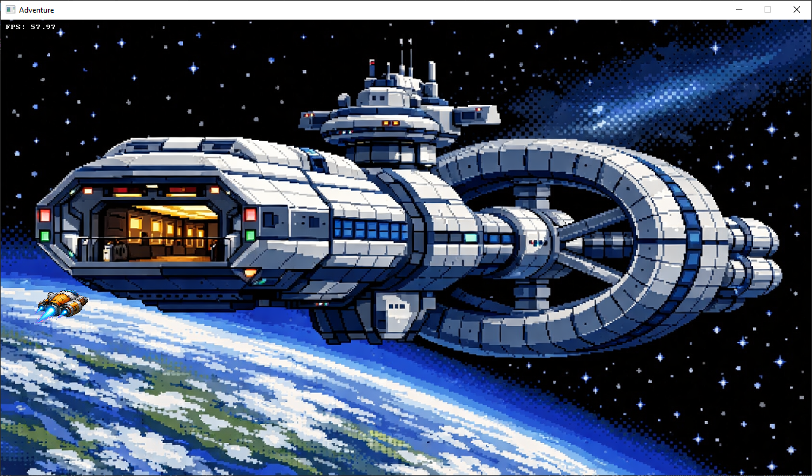
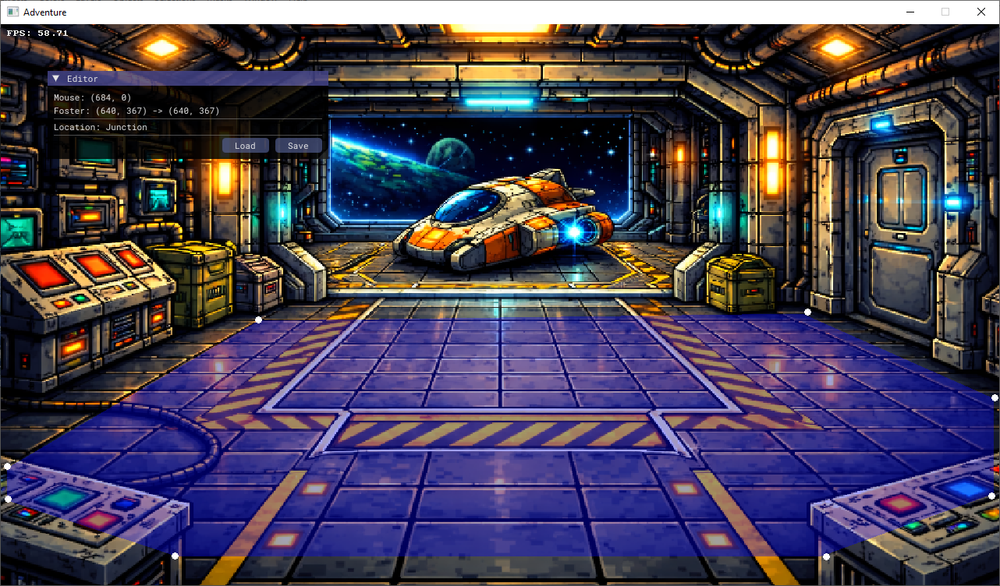

# Implementing Walkable Area for Adventure Game

## Introduction

We have several rooms in our adventure game, each with its own unique layout and design. To allow the player to navigate through these rooms, we need to define walkable areas where the player can move freely. In this article, we will implement a walkable area for our adventure game using a simple convex polygon approach. This will allow us to define the boundaries of the walkable area and ensure that the player cannot move outside of it.

<p align="center">
  
</p>

### Walking from Point A to Point B

When the user selects a point on the screen to move to, we need to calculate a path from the player's current position to the selected point. The character's feet will be used as the reference point for movement and we need to make sure that it never goes outside of the defined walkable area. To achieve this, we will implement a simple pathfinding algorithm that checks for collisions with the boundaries of the walkable area and adjusts the path accordingly.

## Preparations

### Walkable Area Definition

We will define the walkable area as a convex polygon. This means that all interior angles of the polygon are less than 180 degrees, and any line segment drawn between two points within the polygon will lie entirely within the polygon. This simplifies our collision detection and pathfinding logic. Let's define a simple structure for our convex hull that will represent the walkable area:

```c++
struct ConvexHull {
  static constexpr int kMaxVertices = 32;

  int vertexCount;
  bx::Vec2 vertices[kMaxVertices];
};
```

We can validate if a polygon is convex using the cross product of vectors. This is done by travertsing the vertices of the polygon's edges and calculating the cross product for each set of three consecutive vertices. If the sign of the cross product changes, then the polygon is not convex.

```c++
bool isConvex(const ConvexHull& hull) {
  if (hull.vertexCount < 3) {
    return false; // A polygon cannot be convex if it has less than 3 vertices
  }
  bool isPositive = false;
  for (int i = 0; i < hull.vertexCount; ++i) {
    const bx::Vec2& v1 = hull.vertices[i];
    const bx::Vec2& v2 = hull.vertices[(i + 1) % hull.vertexCount];
    const bx::Vec2& v3 = hull.vertices[(i + 2) % hull.vertexCount];
    float crossProduct = (v2.x - v1.x) * (v3.y - v1.y) - (v2.y - v1.y) * (v3.x - v1.x);
    if (i == 0) {
      isPositive = crossProduct > 0;
    } else {
      if ((crossProduct > 0) != isPositive) {
        return false; // Signs differ, not convex
      }
    }
  }
  return true; // All cross products have the same sign, convex
}
```

### Valid Points for Pathfinding

Let's implement a function to check if a point is inside the convex hull. This will be useful for our pathfinding algorithm to ensure that the player does not move outside of the walkable area. Whenever the user is clicking on the screen to move, we will check if the selected point is inside the convex hull. If it is not, we will need to find the closest point on the edge of the hull to move towards instead, however, if it is inside, we can proceed with the pathfinding algorithm to calculate the path from the player's current position to the selected point.

```c++
bool isInside(const ConvexHull& hull, const bx::Vec2& point) {
  // Implement point-in-polygon test (e.g., ray-casting algorithm)
  int intersections = 0;
  for (int i = 0; i < hull.vertexCount; ++i) {
    const bx::Vec2& v1 = hull.vertices[i];
    const bx::Vec2& v2 = hull.vertices[(i + 1) % hull.vertexCount];
    if ((v1.y > point.y) != (v2.y > point.y)) {
      float slope = (v2.x - v1.x) / (v2.y - v1.y);
      float intersectX = v1.x + slope * (point.y - v1.y);
      if (point.x < intersectX) {
        ++intersections;
      }
    }
  }
  return (intersections % 2) == 1;
}
```

<p align="center">
  
</p>

### Pathfinding Algorithm

For pathfinding, we can use a simple algorithm that takes into account the walkable area defined by our convex hull. The algorithm will check for collisions with the edges of the convex hull and adjust the path accordingly. We will need to implement a function that checks if a point is inside the convex hull and another function that calculates the distance from a point to the edges of the hull, let's call it `walkTo`. This function will take the current position of the player and the target position, and return the closest point on the edge of the hull if the target is outside, or the target itself if it is inside.

```c++
bx::Vec2 walkTo(const ConvexHull& hull, const bx::Vec2& from, const bx::Vec2& to) {
  if (isInside(hull, to)) {
    return to; // Target is inside the hull, can walk directly
  }
  // Find the intersection point of the line from 'from' to 'to' with the hull edges
  bx::Vec2 closestPoint = from;
  float closestDistance = std::numeric_limits<float>::max();
  for (int i = 0; i < hull.vertexCount; ++i) {
    const bx::Vec2& v1 = hull.vertices[i];
    const bx::Vec2& v2 = hull.vertices[(i + 1) % hull.vertexCount];
    // Compute intersection of line (from, to) with edge (v1, v2)
    bx::Vec2 edge = bx::sub(v2, v1);
    bx::Vec2 line = bx::sub(to, from);
    float edgeLengthSq = bx::dot(edge, edge);
    if (edgeLengthSq == 0) continue; // Skip degenerate edge
    float t = bx::dot(bx::sub(from, v1), edge) / edgeLengthSq;
    t = bx::clamp(t, 0.0f, 1.0f);
    bx::Vec2 projection = bx::add(v1, bx::mul(edge, t));
    // Check if the projection is on the line segment from 'from' to 'to'
    float lineLengthSq = bx::dot(line, line);
    if (lineLengthSq == 0) continue; // Skip degenerate line
    float u = bx::dot(bx::sub(projection, from), line) / lineLengthSq;
    if (u < 0.0f || u > 1.0f) continue; // Projection is not on the line segment
    float distance = bx::length(bx::sub(projection, to));
    if (distance < closestDistance) {
      closestDistance = distance;
      closestPoint = projection;
    }
  }
  return closestPoint;
}
```

It is now up to the implementation to move the character towards the point returned by `walkTo`. Ths could be done using an approach of linear interpolation or perhaps by first walking across the x-axis and then along the y-axis, depending on the desired movement style. The key point is that the character will always stay within the bounds of the walkable area defined by the convex hull, ensuring a consistent and immersive gameplay experience.

## Summary

The player can now navigate within the defined walkable area of the room. The convex hull approach allows us to easily define complex walkable areas while ensuring that the player cannot move outside of them. By implementing the `walkTo` function, we can calculate the appropriate path for the player to take when moving towards a target point, ensuring that they stay within the bounds of the walkable area. This implementation provides a solid foundation for further enhancements, such as adding obstacles or dynamic elements to the environment. To avoid concave polycons we can use an approach of several convex hulls to define the walkable area, which will allow us to create more complex environments while still maintaining efficient pathfinding and collision detection.
